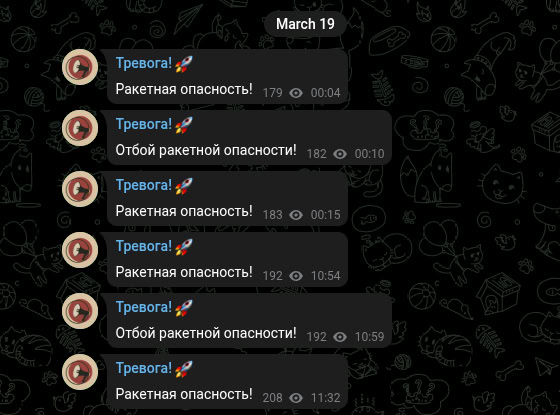

# Тревога! 🚀
Тревоги Белгород.

# Закрытие проекта
Во время последних тревог в городе сообщения в канал не отправлялись не из-за того, что у нас что-то сломалось, а из-за того, что проект закрыт.

Этот проект начинался как идея для индивидуального проекта по информатике. Мне хотелось сделать из него что-то большее, чем просто проект для школы.

Изначально я рассчитывал на "Сарафанное радио", надеясь, что полезность моего канала сама по себе привлечет аудиторию. Однако, мой канал не смог выделиться на фоне множества уже существующих каналов. И, честно говоря, я понимаю, что на деле мой проект просто никому не нужен. Я признаю, что не предложил ничего принципиально нового.

Спасибо всем, кто верил в мой проект.

